# Fresco Markdown

A calm place to read **architecture**, write *ideas*, and inspect `code`.

> The live preview opens automatically and renders these diagrams.
> Reopen it with **Ctrl+P → Fresco Markdown: Open Live Preview** if you close it.
> This gallery contains **24 diagrams** across five supported families.
> Widen the preview pane if a diagram falls back to its source.

Start with the architecture and conversation below, then explore flowcharts,
sequences, state machines, class models, and entity relationships.
Change any node label in the source to demonstrate live updates.

## Architecture

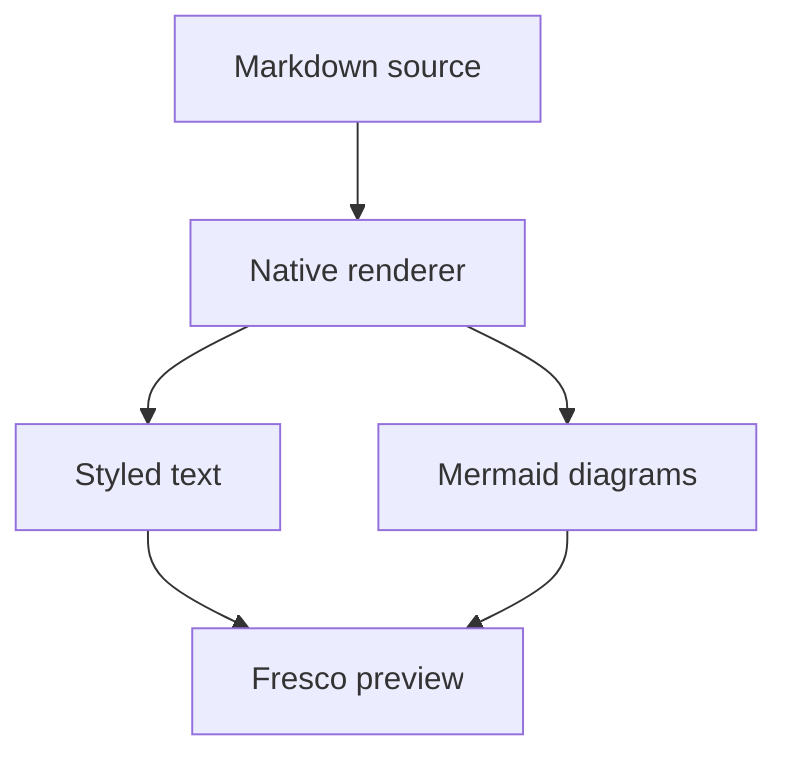

## A conversation

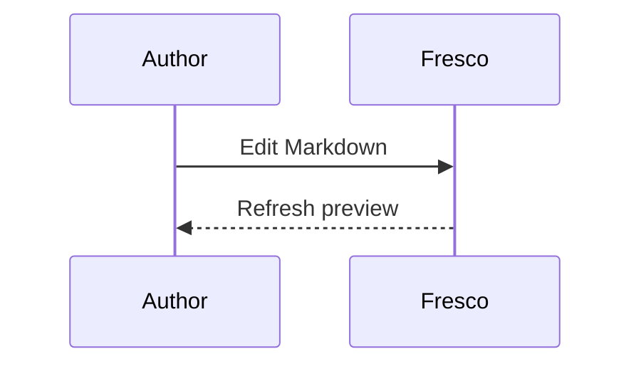

## Flowchart gallery

### 1. A decision with two outcomes

Diamond-shaped decisions and labeled edges make a small review process readable.

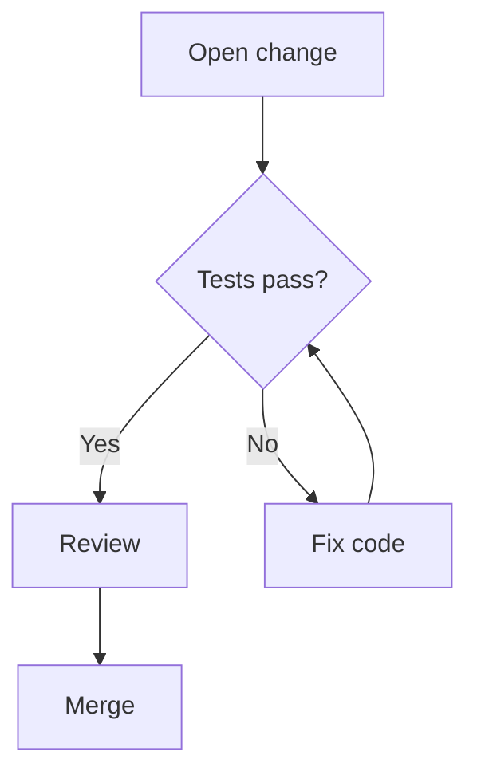

### 2. A left-to-right pipeline

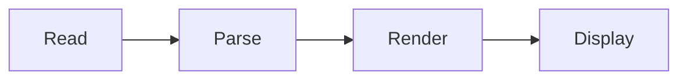

### 3. Parallel checks converge

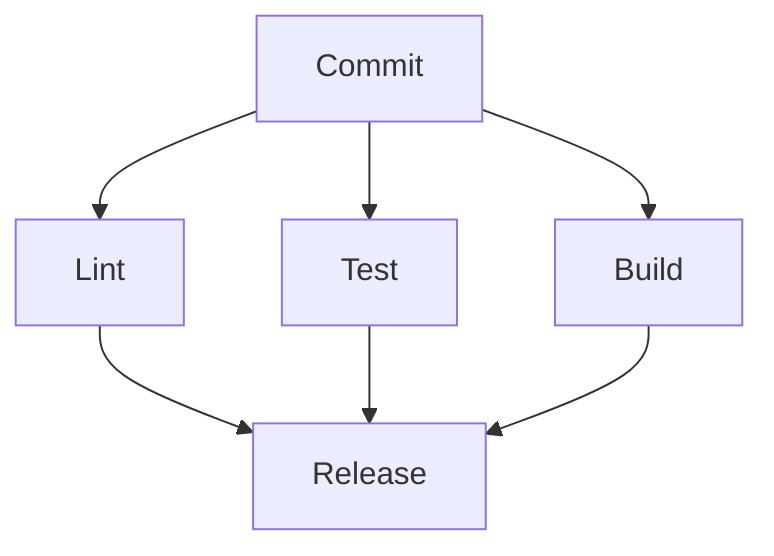

### 4. Service boundaries

Subgraphs draw labeled frames around related components.

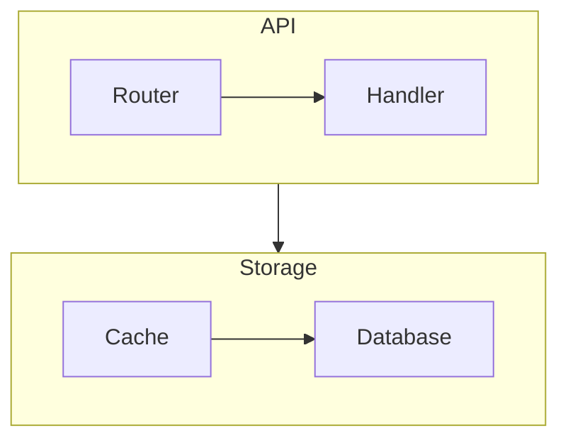

### 5. A retry cycle

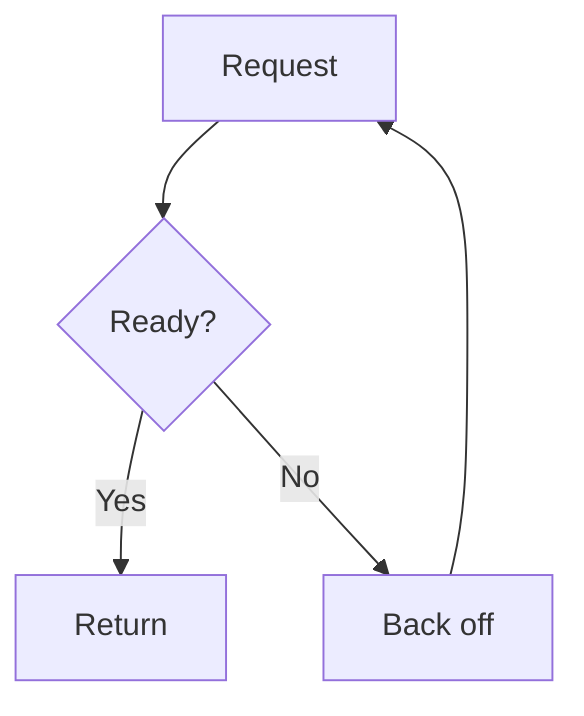

### 6. Different edge styles

Solid, dotted, and thick connections distinguish data, notification, and critical paths.

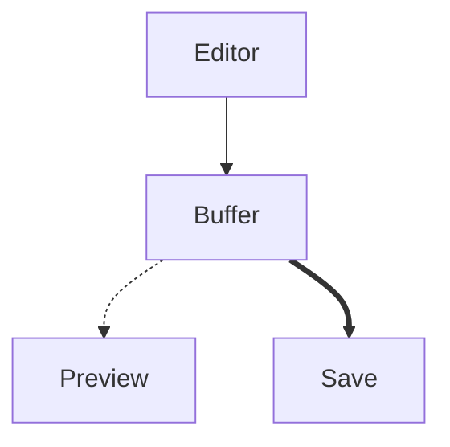

### 7. Bottom-up dependencies

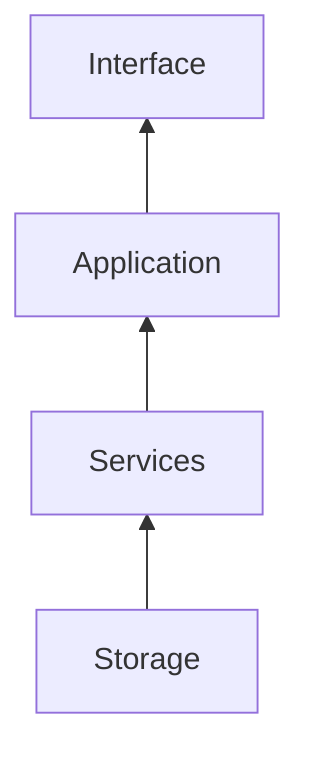

### 8. A self-loop

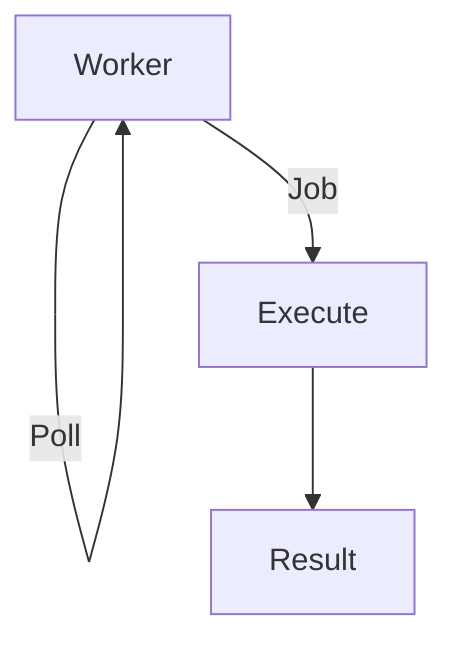

## Sequence gallery

### 9. A login round trip

Aliases give short participant identifiers readable display names.

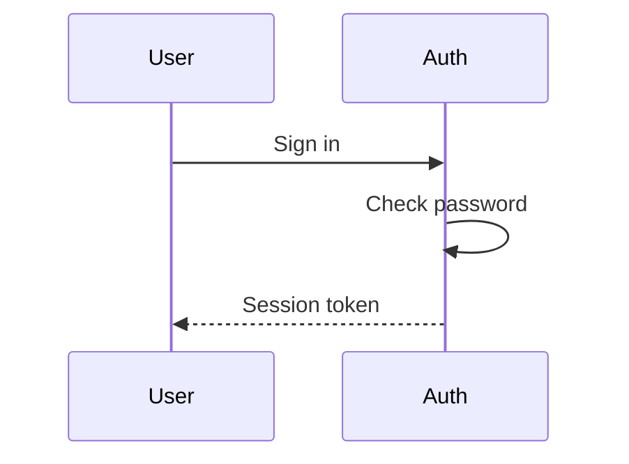

### 10. A cache hit or miss

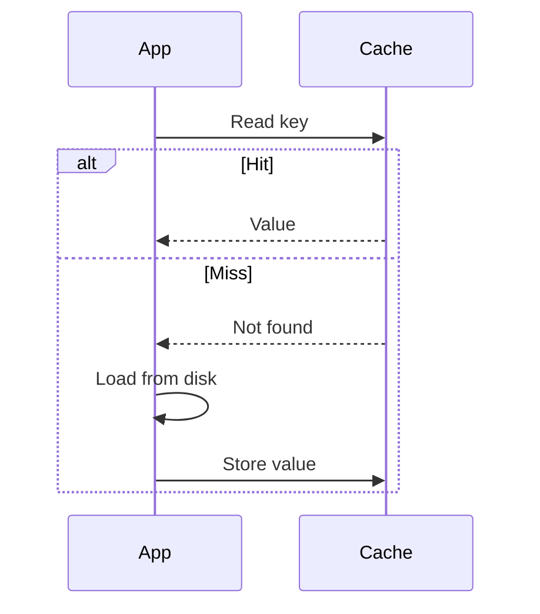

### 11. Numbered retry attempts

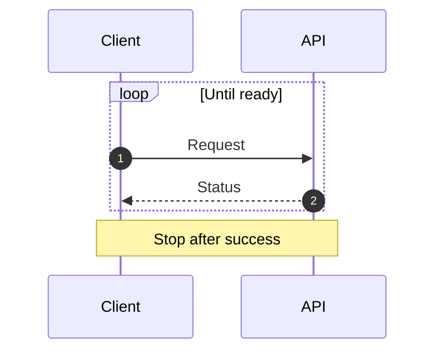

### 12. Background work

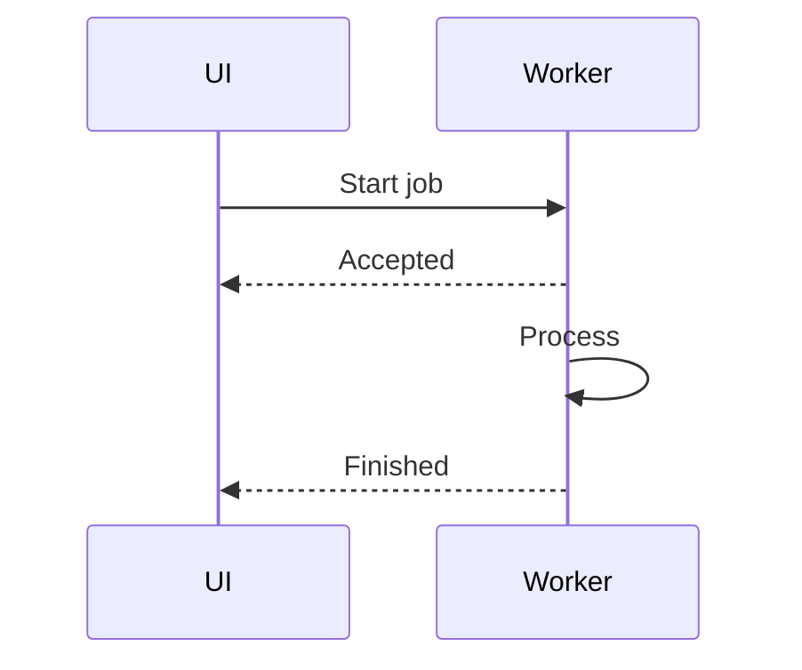

### 13. A guarded operation

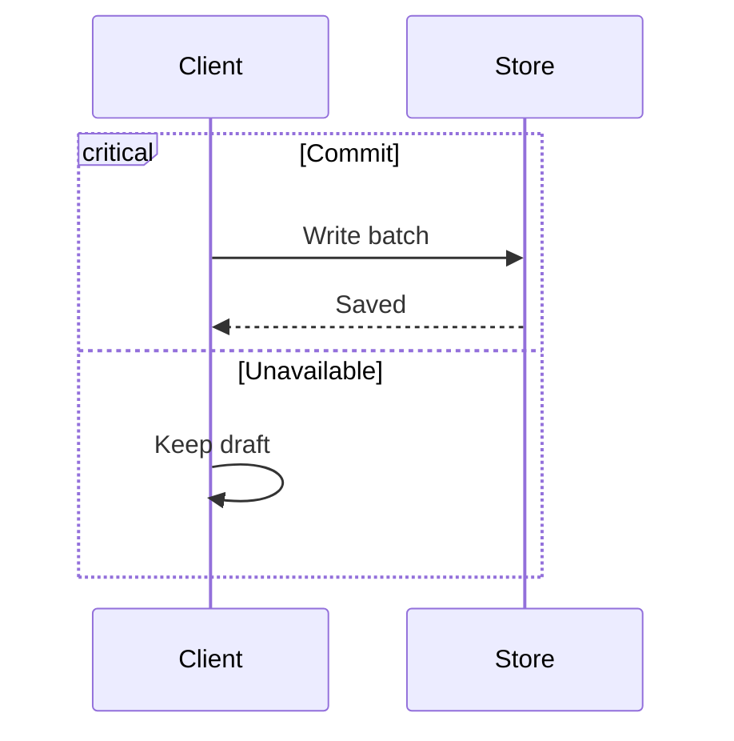

## State-machine gallery

### 14. An editable document

Start and end markers show the complete document lifecycle.

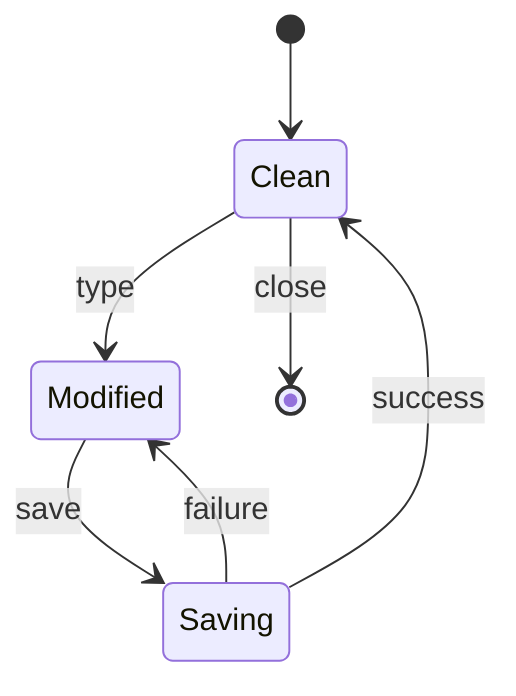

### 15. A deployment

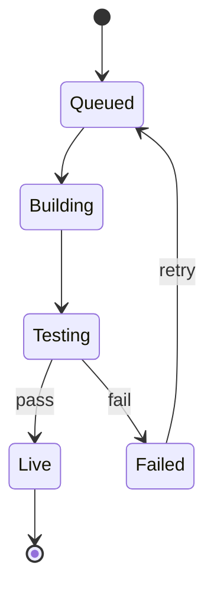

### 16. A background worker

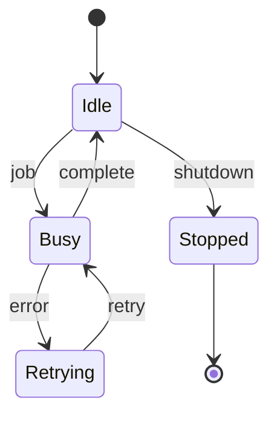

### 17. A review decision

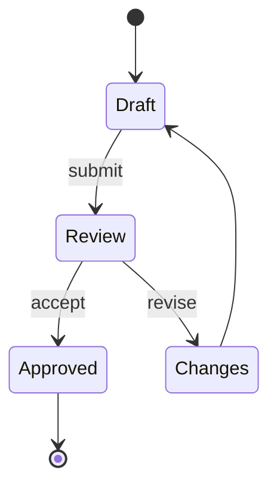

## Class-model gallery

### 18. A plugin contract

Class compartments separate fields and methods; inheritance connects implementations.

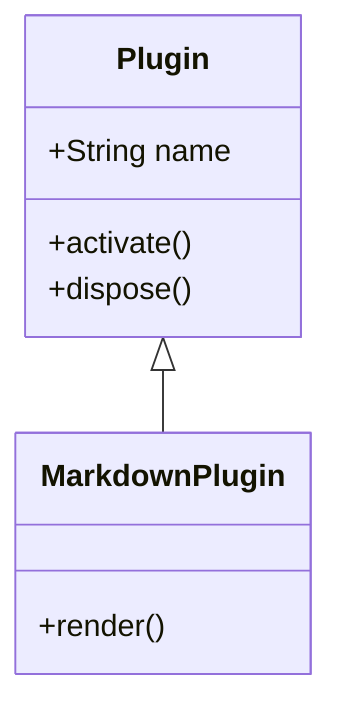

### 19. A document owns its buffer

A filled diamond represents composition.

```mermaid
classDiagram
    class Document {
        +String path
        +save()
    }
    class Buffer {
        +String text
        +insert()
        +delete()
    }
    Document *-- Buffer : owns
```

### 20. An interchangeable renderer

```mermaid
classDiagram
    <<interface>> Renderer
    Renderer : +render()
    class TextRenderer {
        +render()
    }
    Renderer <|.. TextRenderer
```

## Entity-relationship gallery

### 21. Projects and documents

Relationship labels include cardinality; entity boxes list fields and keys.

```mermaid
erDiagram
    PROJECT ||--o{ DOCUMENT : contains
    PROJECT {
        int id PK
        string name
    }
    DOCUMENT {
        int id PK
        int project_id FK
        string path
    }
```

### 22. Customers and orders

```mermaid
erDiagram
    CUSTOMER ||--o{ ORDERS : places
    CUSTOMER {
        int id PK
        string email
    }
    ORDERS {
        int id PK
        int customer_id FK
        string status
    }
```

## Markdown details

| Feature | Behavior |
| --- | --- |
| Markdown | Headings, emphasis, lists and tables |
| Mermaid | Native terminal text |
| Editing | Source stays editable |
| Preview | Updates while you type |

- [x] Preserve source files
- [x] Render without a browser
- [ ] Write the next chapter

Inline math: $E=mc^2$.

```rust
fn main() {
    println!("Hello, Fresco!");
}
```
