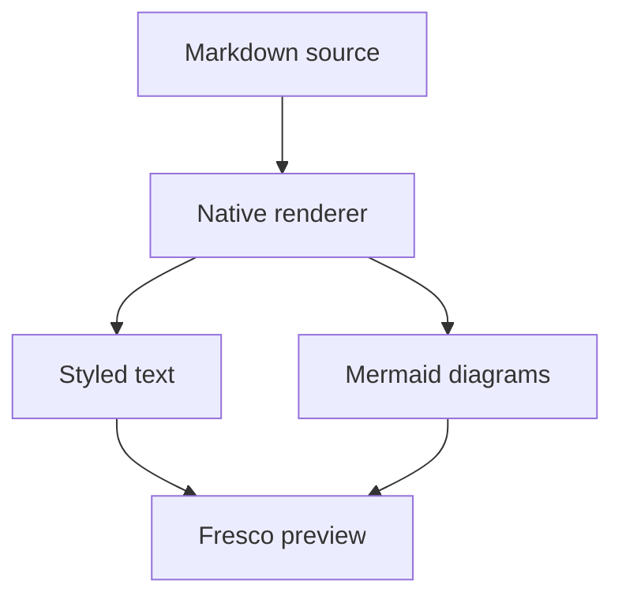
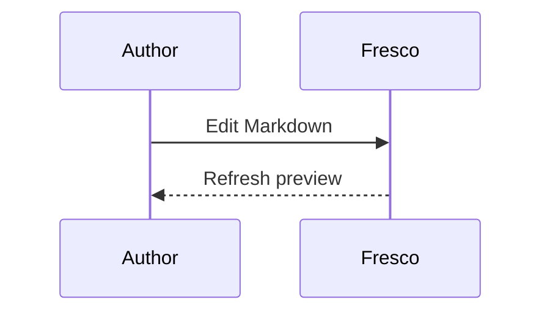

# Fresco Markdown

A calm place to read **architecture**, write *ideas*, and inspect `code`.

> Open **Fresco Markdown: Open Live Preview** from Ctrl+P to render these diagrams.

## Architecture



## A conversation



## Details

| Feature | Behavior |
| --- | --- |
| Markdown | Headings, emphasis, lists and tables |
| Mermaid | Native terminal text |
| Editing | Source stays editable |
| Preview | Updates while you type |

- [x] Preserve source files
- [x] Render without a browser
- [ ] Write the next chapter

Inline math: $E=mc^2$.

```rust
fn main() {
    println!("Hello, Fresco!");
}
```
